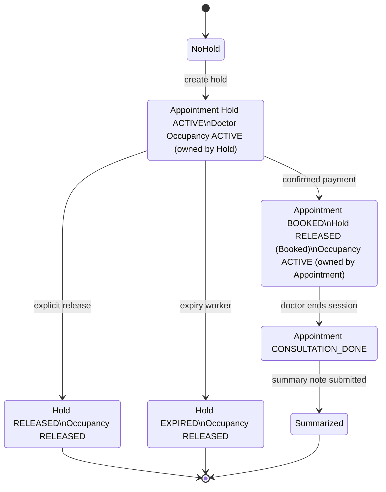

# Appointment flow

This is the current APMv2 runtime flow from a patient's selected doctor/time through consultation completion. It uses the canonical domain terms:

- An **Appointment Hold** is the unpaid, pre-booking claim.
- **Doctor Occupancy** is the capacity record that prevents overlapping holds or appointments.
- An **Appointment** exists only after the booking condition (currently successful payment confirmation) succeeds.
- `bookingId` is the public correlation identifier used by the hold, payment, appointment, APIs, and events. It is distinct from the internal Hold ID and Appointment ID.
- HTTP routes and V1 events retain `booking` / `reservation` wording only as compatibility adapters.

## End-to-end flow

```mermaid
flowchart TD
    start([Patient selects eligible doctor, channel, and time])
    request[Authenticated client\nPOST /v1/booking\nlegacy alias: /v2/booking]
    throttle{Rate limit and\nrequest validation pass?}
    profile[Load DoctorApp-projected profile from Redis\nand validate operational availability]
    eligible{Doctor active, channel + duration supported,\nand instant/schedule window available?}
    create[(One PostgreSQL transaction\ncreate Appointment Hold\n+ active Doctor Occupancy\n+ Hold Prescreen\n+ TimeslotReserved outbox event)]
    quote[Return bookingId and immutable Payment Quote\nstatus: Reserved]
    conflict([Return DoctorNotAvailable\nor SlotAlreadyBooked])

    stop{Before confirmation}
    release[Internal release endpoint\nPOST /internal/v1/booking/:bookingId/cancel\nlegacy compatibility name]
    expiry[Appointment Hold expiry worker]
    released[(Mark Hold Released or Expired\nrelease Doctor Occupancy\nenqueue ReservationCancelled or ReservationExpired)]

    payment[Payment system sends successful\nPub/Sub payment-confirm push]
    verify{Signed transaction, outer envelope, bookingId,\nimmutable quote, config version, and active occupancy valid?}
    payment_rejected([Reject payment confirmation\nwithout booking])
    confirm[(One PostgreSQL transaction\ncreate Appointment: BOOKED\ntransfer Occupancy from Hold to Appointment\nlink source Hold + Prescreen\nrecord payment\nrelease Hold with reason Booked\nenqueue ConsultationBooked)]

    outbox[Event outbox worker\npublishes committed events to Pub/Sub]
    session[Patient or doctor requests\nGET /v2/consultation/session-info/:bookingId\nwithin allowed session time]
    authorize{Participant and appointment\nauthorized and session-ready?}
    session_not_ready([Return Unauthorized, SessionNotFound,\nSessionIsNotReady, or SessionIsFinished])
    provider[Create or reuse Twilio room/chat\nissue participant token\nissue patient RTDB token when applicable]
    joined[(Persist session data and join records\nemit SessionCreated once\nemit PatientJoined / DoctorJoined\nemit AllParticipantJoined once)]
    callbacks[Twilio disconnect callback\nvalidated and deduplicated]
    disconnected[Emit PatientDisconnected\nor DoctorDisconnected]
    end[Doctor POSTs\n/v2/consultation/end-session/:bookingId]
    done[(Set Appointment to CONSULTATION_DONE\nclose Twilio chat when present\nemit SessionTerminated)]
    summary[Internal service submits summary note]
    summarized[(Persist summary note\nemit ConsultationSummarized)]
    followup{Doctor requests\nfollow-up?}
    followup_created[(Create follow-up appointment\nemit FollowUpRequired)]
    complete([Consultation lifecycle complete])

    start --> request --> throttle
    throttle -- no --> conflict
    throttle -- yes --> profile --> eligible
    eligible -- no --> conflict
    eligible -- yes --> create --> quote --> stop

    stop -- explicit release --> release --> released --> outbox
    stop -- TTL expires --> expiry --> released
    stop -- payment succeeds --> payment --> verify
    verify -- no --> payment_rejected
    verify -- yes --> confirm --> outbox

    outbox --> session --> authorize
    authorize -- no --> session_not_ready
    authorize -- yes --> provider --> joined
    joined --> callbacks --> disconnected
    joined --> end --> done --> summary --> summarized --> followup
    followup -- yes --> followup_created --> complete
    followup -- no --> complete
```

## Lifecycle and capacity transitions



## What each boundary guarantees

| Stage | Authority and invariant | Observable result |
| --- | --- | --- |
| Hold creation | `appointment::hold` validates the chosen time, DoctorApp-projected consultation configuration, APMv2 operational availability, and the PostgreSQL occupancy exclusion constraint. | A Hold, its prescreen, and active Occupancy are committed together; the response includes the immutable quote. |
| Release or expiry | A Hold is not an Appointment. Releasing or expiring it releases its Occupancy and does not create an Appointment. | Compatibility events use `ReservationCancelled` or `ReservationExpired`; they describe a canonical Hold transition. |
| Payment confirmation | `consultation-bg-rs` verifies the signed payment transaction and cross-checks its amount, currency, service-config version, booking ID, and payment facts against the immutable Hold quote. | The database either atomically books exactly one Appointment and transfers Occupancy, or rejects the confirmation. Conflicting payment replays fail; identical replay remains safe. |
| Event delivery | State-changing hold/payment operations enqueue events in `v2.event_outbox` in the same transaction. `consultation-rs` session events use the outbox publisher, which attempts direct delivery and leaves failures available to the outbox worker. | Consumers receive V1-compatible event names only after their underlying committed state exists. |
| Session access | Public session-info accepts a `bookingId`, resolves the canonical Appointment at the SQL boundary, checks the caller and time window, then creates/reuses the provider session. | Only the patient or doctor assigned to the booked Appointment can receive session information; only an authorized patient receives RTDB access. |
| Completion | A doctor ends the consultation; summary and optional follow-up are separate post-session work. | `SessionTerminated`, then `ConsultationSummarized`; an optional follow-up emits `FollowUpRequired`. |

## Current compatibility and scope notes

- Preferred public Hold routes are `POST /v1/booking` and `GET /v1/booking/{bookingId}/state`; `/v2/booking` aliases remain. The only Hold release route is internal: `POST /internal/v1/booking/{bookingId}/cancel`.
- The internal route name `cancel` is a legacy adapter. It calls `release_hold` and rejects a booking that has already become an Appointment; it is not booked-Appointment cancellation.
- Payment confirmation enters `consultation-bg-rs` at `POST /pubsub/payment-confirm`; it is enabled only when payment confirmation is configured.
- The current session and end-session public APIs use `bookingId`, while the database resolves and stores the canonical internal Appointment ID. Do not infer that the identifiers are interchangeable.
- The active published AsyncAPI is V1-only. The event labels above are therefore intentionally V1-compatible even when the underlying runtime domain uses Appointment Hold and Doctor Occupancy.

## Source map

- Domain terminology: [CONTEXT.md](https://github.com/kanenggg/tdh-biz-doctor-apmv2/blob/main/CONTEXT.md)
- Hold HTTP boundary and validation: `consultation-rs/src/appointment/hold/handler.rs`, `consultation-rs/src/appointment/hold/create.rs`
- Hold persistence, quote, and legacy event adapters: `consultation-rs/src/appointment/hold/repo.rs`
- Payment confirmation: `consultation-bg-rs/src/payment_confirm/service.rs`, `consultation-bg-rs/src/payment_confirm/repo.rs`
- Atomic lifecycle functions: `db/biz_apm/migrations/20260713000003__appointment_hold_cutover.sql`
- Outbox delivery: `consultation-rs/src/infra/event/outbox.rs`, `consultation-bg-rs/src/event_outbox/`
- Session, provider callback, and termination: `consultation-rs/src/consultation/session_info/service.rs`, `consultation-rs/src/provider_callback/service.rs`, `consultation-rs/src/consultation/end_session/service.rs`
- Summary and follow-up: `consultation-rs/src/summarization/service.rs`
