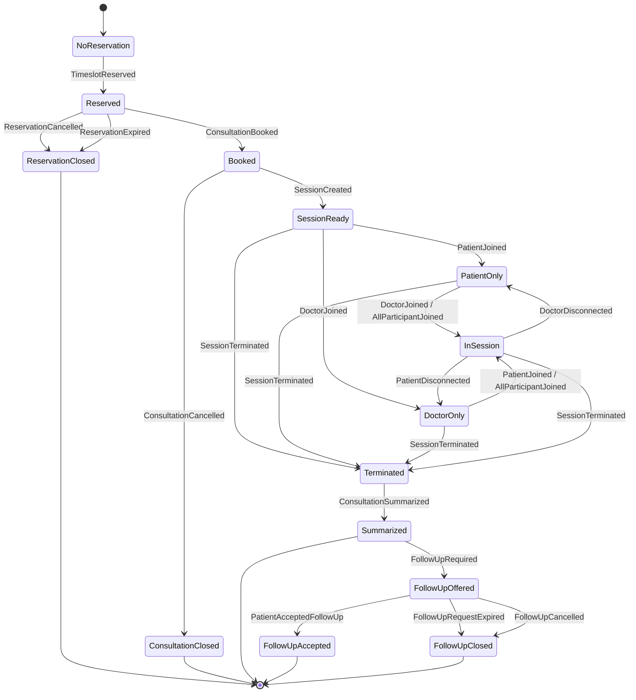

# Consultation Event State Diagram

This diagram maps consultation events into lifecycle states. It is language and
tool agnostic: event names are the integration contract, and states describe the
business position of the consultation.

## Event Groups

### Pre-session

| Event | Meaning | Next state |
| --- | --- | --- |
| `TimeslotReserved` | A patient reserved a doctor's available slot. | `Reserved` |
| `ReservationCancelled` | The reservation was cancelled before booking. | `ReservationClosed` |
| `ReservationExpired` | The reservation timed out before booking. | `ReservationClosed` |
| `ConsultationBooked` | Payment or confirmation completed and the consultation is booked. | `Booked` |
| `ConsultationCancelled` | A booked consultation was cancelled. | `ConsultationClosed` |

### Session

| Event | Meaning | Next state |
| --- | --- | --- |
| `SessionCreated` | The meeting/session provider created a session for the booking. | `SessionReady` |
| `PatientJoined` | The patient joined the session. | `PatientOnly` or `InSession` |
| `DoctorJoined` | The doctor joined the session. | `DoctorOnly` or `InSession` |
| `AllParticipantJoined` | Both patient and doctor are present. | `InSession` |
| `PatientDisconnected` | The patient disconnected from an active session. | `DoctorOnly` |
| `DoctorDisconnected` | The doctor disconnected from an active session. | `PatientOnly` |
| `SessionTerminated` | The consultation session ended. | `Terminated` |

### Post-session

| Event | Meaning | Next state |
| --- | --- | --- |
| `ConsultationSummarized` | The consultation summary was completed. | `Summarized` |
| `FollowUpRequired` | The doctor created a follow-up request after summary. | `FollowUpOffered` |
| `PatientAcceptedFollowUp` | The patient accepted the follow-up request. | `FollowUpAccepted` |
| `FollowUpRequestExpired` | The follow-up request expired. | `FollowUpClosed` |
| `FollowUpCancelled` | The follow-up request was cancelled. | `FollowUpClosed` |

## Tool State

| State | Meaning |
| --- | --- |
| `NoReservation` | No active reservation exists. |
| `Reserved` | A slot is temporarily held for the patient. |
| `ReservationClosed` | The hold ended before booking. |
| `Booked` | The consultation is confirmed. |
| `ConsultationClosed` | The booked consultation was cancelled before session completion. |
| `SessionReady` | A session exists, but participants are not both present. |
| `PatientOnly` | The patient is present without the doctor. |
| `DoctorOnly` | The doctor is present without the patient. |
| `InSession` | Patient and doctor are both present. |
| `Terminated` | The session ended. |
| `Summarized` | The consultation summary was completed. |
| `FollowUpOffered` | A follow-up request is available to the patient. |
| `FollowUpAccepted` | The patient accepted the follow-up request. |
| `FollowUpClosed` | The follow-up request expired or was cancelled. |
